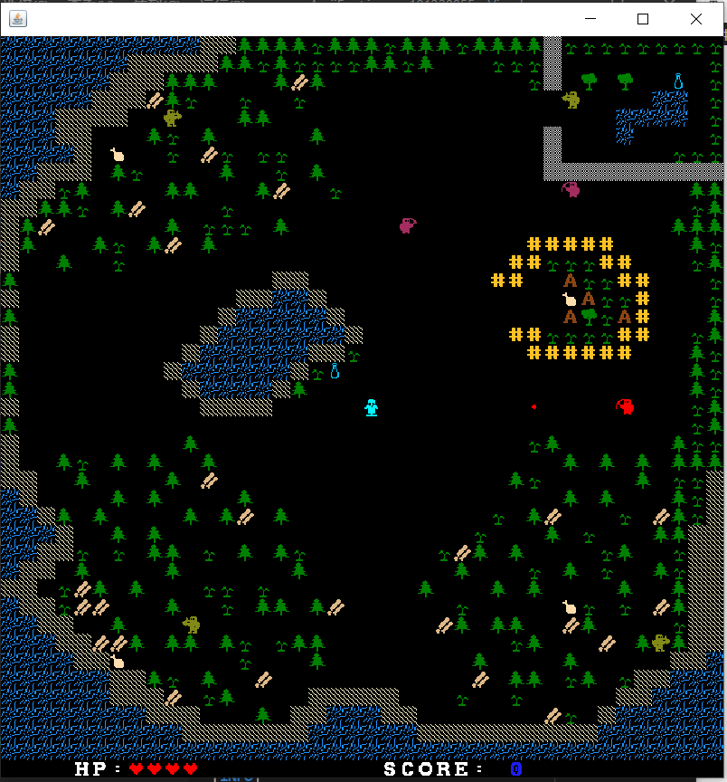

# W05

姓名：梁安泽

学号：191220055

[TOC]

### 设计思路

###### 关于玩法

我的想法是：设计玩家对抗bot，当所有bot都被消灭之后，玩家即可获胜；反之如果玩家被bot消灭，则bot获胜

玩家应当具备以下特点

* 可以自由移动以及远程攻击
* 具有hp属性和score属性，其随着游戏进度而改变

bot应当具备以下特点

* 可以攻击玩家，按照攻击方式分为远程攻击bot和近战bot，我将他们分别命名为Shooter和SworksMan
* 远程攻击bot因为攻击范围较大，为平衡游戏，其移动速度较小，且活动范围较小
* 近战bot由于攻击方式上处于劣势，因此移动速度较快，活动范围较大

最后，无论是玩家还是bot，都应当具备攻击冷却时间。

###### 关于UI

UI这个事情是最让人头疼的，默认的jw04的实现起来确实方便，但是美感明显不足。于是我决定另外寻找字体点阵图，尝试修改原有的字体，于是我的实现过程经历了以下阶段

* 自定义贴图。通过寻找游戏贴图，并利用脚本将其转换到固定大小，最后输出到panel中，然而效果并不理想

* 寻找已有的贴图，通过在网上一番搜寻，最终找到一张比较满意的点阵图

  

  如果直接使用这张图片，颜色会出现异常，因此我又利用脚本将其转换成黑白的样式（在分划的效果这件事情上又折腾了好久）。因为人物图标需要左右两个方向，因此我利用脚本做了人物字体的镜像效果。

最后成品的效果如下：



自我感觉还行。


### 多线程&race condition

###### 关于多线程

除了主线程，我还创建了以下线程：

* 用于刷新屏幕的线程，其每一秒刷新十次画面（经过试验，不影响输出效果）
* 玩家线程，其用于接收输入（移动和攻击），并更新玩家信息（hp和得分）
* 各个bot线程，每个线程对应一个bot
* 炮弹线程，该线程用于管理一个炮弹队列，以实现炮弹的移动（炮弹发射出去之后，不应当继续归玩家或bot来控制和管理）

###### 关于race condition

游戏的race condition无非就是两类：地图上新物体的放置，如发射新炮弹，放置新的地图元素；以及地图上物体的移动，如炮弹和移动，角色的移动。

为了解决race condition的问题，我定义了一个类`Map`，其储存着整个地图的信息。`Map`中定义了一把可重入锁，当尝试移动物体或者放置物体时，必须先进行加锁，再做处理

```java
public class Map {
    private int[][] map; //地图各点的信息
    private Lock lock; //可重入锁
}
```

主线程通过将唯一的Map实例传给各个地图物体，使每个物体在改变地图状态的时候不得不调用Map实例中的方法，以此达到统一管理的目的。例如玩家试图移动的时候，调用moveTo方法(继承于Creature类)，在Creature类当中会尝试对地图物体进行移动

```java
    public boolean moveTo(int beginX, int beginY, int targetX, int targetY) {
        if (map.moveThing(beginX, beginY, targetX, targetY, false,null)) {
            return true;
        } else {
            // System.out.println("blocked!");
            return false;
        }
    }
```

当物体需要消失的时候，消失的行为应当发生在对map的调用当中。例如炮弹击中了目标，玩家消灭了bot


### 算法

算法主要是用于控制bot类的行为，两种bot的算法如下：

* 近战bot因为需要接近玩家才能进行攻击，因此我在bot类当中添加了寻路算法，核心就是BFS。同时bot具备“感知距离”参数，当玩家进入到bot的活动范围以内，并且进入bot的“感知距离”以内，bot就会发动攻击。大概处理逻辑如下

  ```java
                  curPos = getPos();
  				targetPos = target.getPos();
                  if (enemyComing(curPos, targetPos)) { //  敌人进入了活动区域，并在”感知距离“以内         
                      if (!reachTarget(curPos.first, curPos.second, targetPos.first, targetPos.second)) {
                          // 还没有到达敌人的位置
                          calculateDist(curPos.first, curPos.second); //计算距离
                          nextStepDirection = getNextStep(targetPos.first, targetPos.second);//下一步的方向
                          moveTo(nextStepDirection); //尝试移动
                      } else {
                          ... //对玩家发动攻击
                      }
                  } else {// do nothing
                      randomWalk();
  ```

  其细节不再过多展示

* 远程bot的逻辑相对简单。它的攻击方向即为以自身所在坐标为中心的十字方向，攻击范围即为沿十字方向可以到达的一切位置。当玩家进入其攻击范围以内时，便会发动攻击

  ```java
  				curPos = this.getPos();
                  targetPos = target.getPos();
                  if ((targetStepDirection = isFire(curPos, targetPos)) != 0) { // 玩家处于攻击位置
                      ...
                  	attack(curPos, targetStepDirection);
                      ...
                  } else {// do nothing
                      randomWalk();
                  }
  ```


### 一点感受

1. 上述的过程看起来并不是十分复杂，但是我却花费了大量的时间来实现。首先这和我的目标不明确有一定的关系：刚开始我的想法是操作玩家逃离迷宫，后来觉得不利于后续实验，又修改为玩家和bot对打（地图花了两三次，每一次都得一两个小时）。其次也和代码的复杂程度有一定的关系，很多时候多线程调试起来非常费劲，经常还得上插桩法大量输出结果，然后逐条分析:(

2. 当然也不是没有收获，首先是学到了多线程的用法，其次还学会了如何在多线程的角度去思考程序执行过程中的状态，以及可能造成的问题

3. 刚开始花费了大量的心思在算法上，甚至想复刻在csgo中的常用战术：crossfire，来对付玩家，但是最终还是放弃了这一想法。同时，刚开始也想过手撸一个min-max算法，还找了不少博客来学习，但最后还是放弃了。直到我写报告这一会儿，我才真正意识到：下一步的任务是改为多人对战，如果我一头扎进了算法的坑里，或许我的成果只能停留在这次作业当中，并不划算。
4. java语言用起来确实非常方便，各种对象的创建和引用都十分的便利。但是这一好处似乎又会造成代码中的乱像，各种引用指来指去，你用用我也用用，不仅不利于代码的可读性，更不符合”利用java刻画现实世界“这一更高层面的追求。不说了，我现在马上就去优化我的代码......


